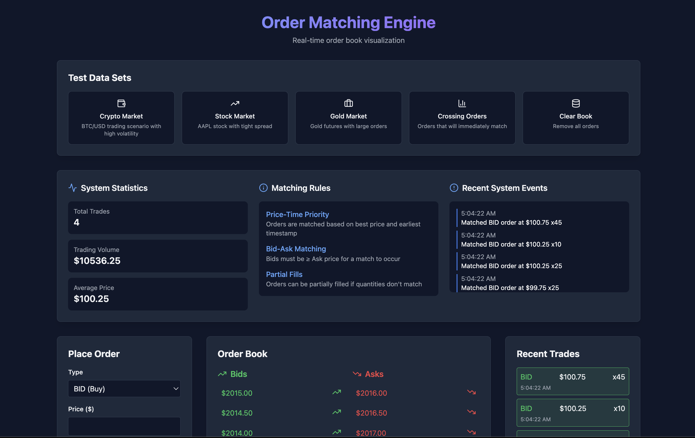

# Order Matching Engine Demo

A real-time order matching system demonstration with a modern web interface. This project showcases a simplified version of how financial exchanges match buy and sell orders, implemented using modern web technologies and Redis for high-performance order processing.

## 📸 Screenshot



*A modern interface showing real-time order book, trade history, and order placement.*

## 🌟 Features

- **Real-time Order Matching**
  - Price-time priority matching algorithm
  - Support for partial order fills
  - Immediate order execution
  - Live order book updates

- **Modern Web Interface**
  - Real-time order book visualization
  - Interactive trade history
  - Market depth display
  - Responsive design with Tailwind CSS

- **Robust Backend**
  - Redis-powered order processing
  - WebSocket real-time updates
  - Persistent storage with Redis AOF
  - RESTful API endpoints

## 🛠️ Tech Stack

### Backend
- Node.js with Express
- Redis for order matching and storage
- WebSocket for real-time updates
- REST API for order management

### Frontend
- React 18 with Vite
- Tailwind CSS for styling
- Real-time data visualization
- Modern responsive UI

## 📦 Prerequisites

- Node.js (v16 or higher)
- Redis (v6 or higher)
- npm or yarn package manager

## 🚀 Getting Started

1. **Clone the repository**
   ```bash
   git clone <repository-url>
   cd order-matching-engine
   ```

2. **Setup Backend**
   ```bash
   cd backend
   npm install
   # Start Redis server
   npm run start:redis
   # In a new terminal
   npm run dev
   ```

3. **Setup Frontend**
   ```bash
   cd frontend
   npm install
   npm run dev
   ```

4. Open your browser and navigate to `http://localhost:5173`

## 🏗️ Project Structure

```
order-matching-engine/
├── backend/                 # Node.js backend server
│   ├── src/                # Source files
│   ├── redis.conf          # Redis configuration
│   └── package.json        # Backend dependencies
├── frontend/               # React frontend
│   ├── src/               # Source files
│   ├── public/            # Static files
│   └── package.json       # Frontend dependencies
└── README.md              # Project documentation
```

## 🧪 Testing

The system includes test datasets for various market scenarios:
- Basic order matching
- Partial fills
- Edge cases handling
- High-frequency trading simulation

## 📈 Performance

- Sub-millisecond order matching
- Capable of handling thousands of orders per second
- Real-time updates with minimal latency
- Efficient memory usage with Redis

## 🤝 Contributing

Contributions are welcome! Please feel free to submit a Pull Request.

## 📝 License

This project is licensed under the MIT License - see the LICENSE file for details.

## 🙏 Acknowledgments

- Inspired by real-world financial exchange systems
- Built with modern best practices in mind
- Optimized for educational purposes and demonstrations 